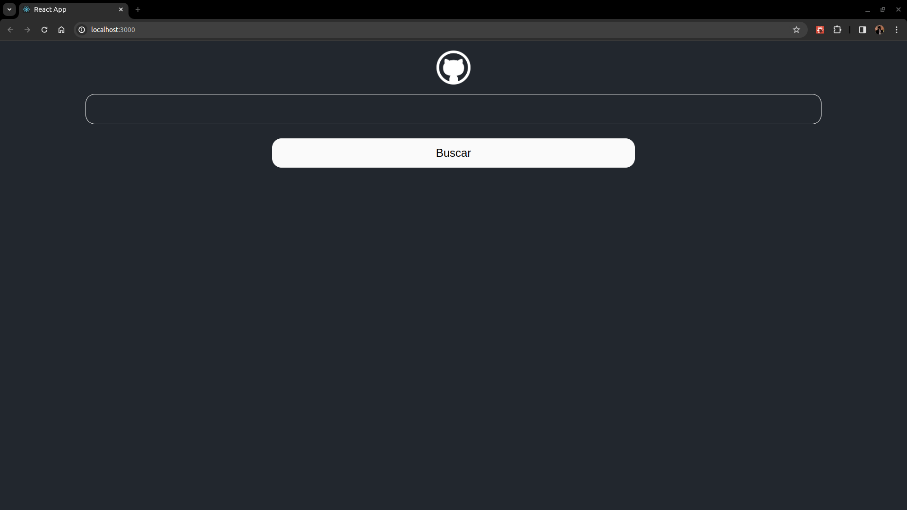
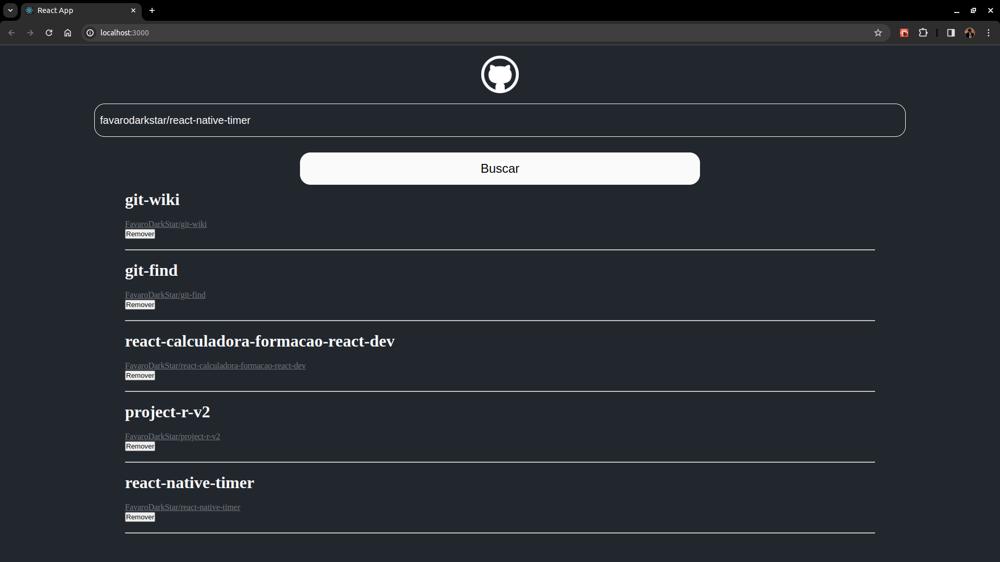

# Projeto: Git Wiki

Este projeto foi desenvolvido como parte do desafio **Criando Uma Wiki de Repositórios do GitHub Com React - Digital Innovation One**.




## Descrição
O Git Wiki é uma aplicação que busca repositórios usando a API do GitHub por meio da biblioteca Axios.

## Funcionalidades
- Busca e exibe repositório GitHub por meio do nome completo (usuario/nome-do-repositorio)
- Remove repositório exibido

## Como usar

1. Clone o repositório para o seu ambiente local:

   ```bash
   git clone https://github.com/FavaroDarkStar/git-wiki.git
   ``` 
 
2. Acesse o diretório do projeto:

   ```bash
   cd git-wiki
   ```

3. Instale as dependências necessárias:

   ```bash
   npm install
   ```

4. Execute o aplicativo:

   ```bash
   npm start
   ```

5. Abra o navegador e acesse [http://localhost:3000](http://localhost:3000) para visualizar o aplicativo em ação.

6. Preencha o input com o nome completo do repositório(usuario/nome-do-repositorio) e clique no botão 'Buscar'.

Agora você está pronto para explorar e experimentar o Git Wiki!
